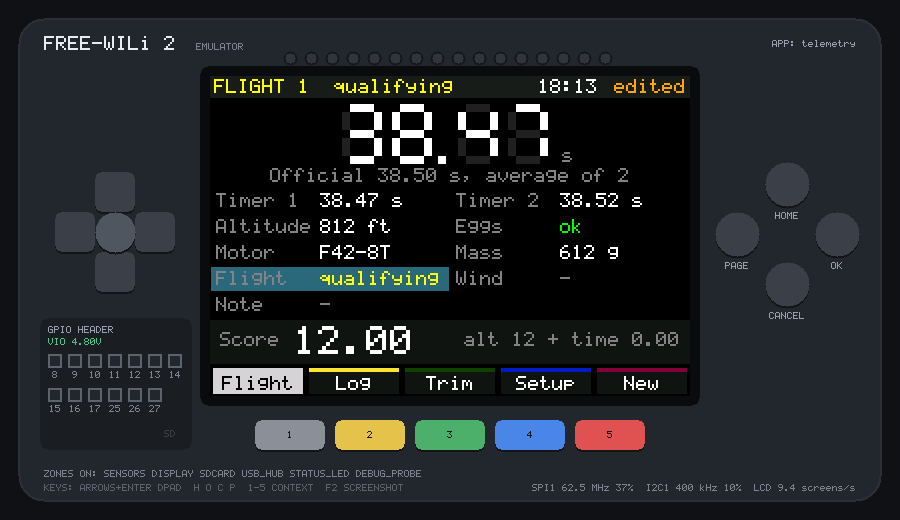
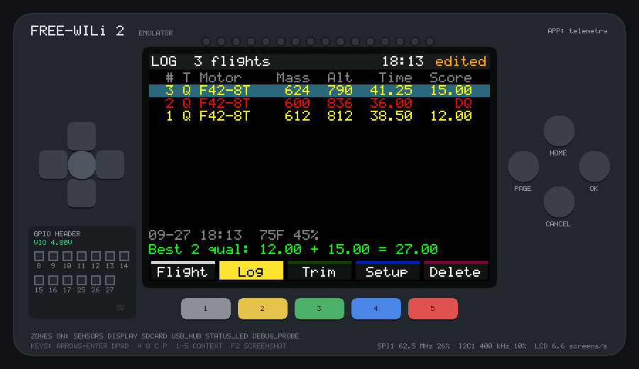
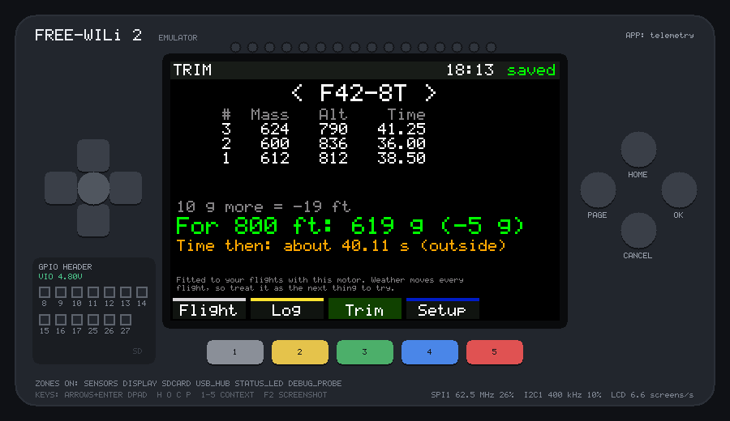

# Telemetry

A launch-day logbook for [American Rocketry Challenge](https://www.rocketrychallenge.org/)
teams, on the [FREE-WILi 2](https://freewili.com). It times each flight,
works out its ARC score as you type the altimeter's reading, keeps every
flight on the SD card, and uses your own flights to estimate the mass that
should hit the target altitude. Built on WiliBSP, and tested on every push
in the [FREE-WILi 2 emulator](https://dfdarty.github.io/freewili2-emu/).



## Scoring

These are the 2027 rules ([handbook](https://www.rocketrychallenge.org/wp-content/uploads/2027-ARC-Handbook.pdf),
v27.1): a target of **800 ft** and **37 to 40 seconds**, both changeable
in Setup (the Finals target is announced on the day).

- **Altitude score:** the difference in feet between the target and the
  altimeter's reading.
- **Duration score:** 4 × the seconds outside the window (0 inside it).
- **Official time:** the average of the two timers, to 0.01 s, with .005
  rounded up. If only one timer ran, its time is used.
- **Disqualified:** either egg cracked.
- **Qualifying:** the best two of your (up to three) qualifying flights are
  added together.

Lower is better. Each flight keeps the target and window it was flown
under, so changing them later doesn't rescore old flights.

## Using it

The five colour buttons under the screen pick the page: **grey** Flight,
**yellow** Log, **green** Trim, **blue** Setup. **Red** is the page's own
action (New on Flight, Delete on Log).

### Flight

| To | Do |
|---|---|
| time the flight | **OK** at first motion, **OK** at touchdown (or when it's lost from view). OK stops the timer from any page |
| fix a false start | hold **CANCEL** for a second: the timer clears |
| fill in a field | tap it, or move to it with the D-pad and press **CENTER**. Type, then **done** or **OK**; **back** or **CANCEL** leaves it as it was. An empty value means "not known" |
| mark eggs cracked, or a qualifying flight | tap **Eggs** or **Flight**: they switch |
| start the next flight | **red (New)**. Motor, mass and practice/qualifying carry over |

**Timer 1** is the stopwatch. Type over it if you are copying the official
timers' readings, and put the second timer's reading in **Timer 2**. The score
at the bottom updates as you go. When a flight first goes into the log
(its first OK, or its first typed value), it is stamped with the date and
time, and with the temperature and humidity from the FW2's own sensor. That
sensor sits inside the case, so it reads high in the sun or in a warm hand.

### Log



Newest flight first: **Q** qualifying, **P** practice, DQ in red. The line
under the list shows the selected flight's date, weather and note, and the
last line shows your best two qualifying flights added up. Move with the
D-pad; **OK**, **CENTER** or a second tap opens a flight to edit it.
**Red (Delete)** twice removes it.

### Trim



For one motor (left/right to change), the app fits a straight line of
altitude against liftoff mass through your flights and gives:
- how much 10 g changes the altitude;
- the mass that should reach the target;
- the flight time to expect at that mass.

It needs flights at two different masses. It warns you when the answer
would go over the 650 g liftoff limit, or when altitude isn't falling as
mass goes up (which usually means a typo, or a different parachute).
Wind, temperature and the motor lot move every flight, so treat the answer
as the next thing to try, not a promise.

### Setup

The target altitude, the duration window, your team name and the FW2's clock
(`2027-05-16 09:41`). New targets apply from the next flight.

## The file

Everything is in `/appdata/telemetry/flights.csv` on the SD card in the
MAIN processor's slot, one row per flight. Excel, Google Sheets and
LibreOffice open it directly:

```text
flight,date,time,type,motor,mass_g,wind_mph,temp_f,humidity_pct,timer1_s,timer2_s,duration_s,altitude_ft,eggs,target_ft,window_s,altitude_score,duration_score,score,note
1,2027-05-16,09:41,qualifying,F42-8T,612,5,72,45,38.47,38.52,38.50,812,ok,800,37.00-40.00,12,0.00,12.00,
```

The score columns are there for the spreadsheet; the app works them out
again when it reads the file. It saves a moment after each change, never
while the stopwatch runs, and a save is crash-safe: the new file is written
first and only then replaces the old one. Settings are in `settings.txt`
next to it.

## Run it on your PC

Once, get the emulator (Linux, WSL2 on Windows, or a Codespace):

```sh
git clone --recurse-submodules https://github.com/dfdarty/freewili2-emu ~/freewili2-emu
```

Then, from this folder:

```sh
~/freewili2-emu/tools/fw2emu run .                  # in a window; the SD card is ./sdcard
~/freewili2-emu/tools/fw2emu test .                 # run test.txt: PASS or FAIL
~/freewili2-emu/tools/fw2emu hwcheck --fetch-toolchain .   # fits the chip? also builds the UF2
```

Keys in the emulator window: click the screen to touch it; arrows and Enter
for the D-pad; H O C P for HOME, OK, CANCEL, PAGE; 1–5 for the colour
buttons. The board clock starts at the PC's local time;
`--rtc "2027-05-16 09:30:00"` sets it.

## How it's built

- `main.c`: one file. Drawing goes to a framebuffer in PSRAM, and only the
  rows that changed are sent to the LCD, by DMA.
- A PSRAM app (`fw2_psram_app`): the board-clock calls are OneWili text
  commands, which need about 10 KB of stack. A PSRAM app leaves the SRAM to
  the stack.
- The stopwatch reads the time when the main loop sees the button, every
  2 ms or so, before anything else. At first motion the app then reads the
  clock and the sensor once, to stamp the flight; after that it doesn't
  touch the card or the clock until the stopwatch stops, so nothing delays
  a press.
- `test.txt` flies three flights through the touch screen, including a
  disqualified one. It checks the scores, the best-two total and the trim
  estimate, clears a false start, and changes the target. `test.expect`
  checks the CSV that ends up on the SD card.

On the real chip (`fw2emu hwcheck`): 70 KB image, 200 KB of SRAM, 766 KB
of PSRAM, 11.4 KB of stack.

Unofficial; not affiliated with FREE-WILi LLC or the American Rocketry
Challenge.
